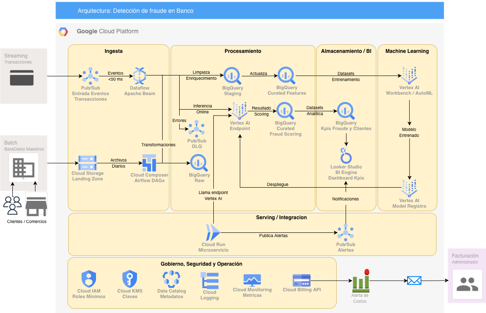

# Arquitectura de Datos, BI y ML en GCP para un Banco

**Curso:** Cloud Computing para Data Science  
**Profesor:** Ahmad Armoush  
**Fecha:** Octubre 2025  
**Integrantes:**  
- Leslie Cartagena
- German Ruiz  

---

## Descripción del Caso
Este proyecto propone una arquitectura *end-to-end* en **Google Cloud Platform (GCP)** para resolver dos necesidades típicas del sector bancario:
1. **Detección de fraude en tiempo casi real.**  
2. **Analítica de clientes y visualización ejecutiva de KPIs.**

El diseño integra servicios de GCP para **ingesta, procesamiento, almacenamiento, machine learning y visualización**, garantizando **latencia baja, seguridad, elasticidad y control de costos**.

---

## Diagrama de Arquitectura
<div align="center">
  
</div>

**Capas principales:**
- **Ingesta:** Pub/Sub, Cloud Storage, Cloud Composer  
- **Procesamiento:** Dataflow, Vertex AI Endpoint, DLQ  
- **Almacenamiento/BI:** BigQuery, Looker Studio  
- **ML:** Vertex AI Workbench, Model Registry  
- **Integración:** Cloud Run, Pub/Sub (alertas)  
- **Gobierno:** IAM, KMS, Data Catalog, Logging, Budgets  

---

## Flujo de Datos
| Flujo | Descripción | Latencia Esperada |
|-------|--------------|------------------|
| Streaming (fraude) | Pub/Sub → Dataflow → Vertex AI Endpoint → BigQuery | ≤ 500 ms |
| Batch (analítica) | Cloud Storage → Composer → BigQuery → Looker Studio | D+1 |

---

## KPIs Principales
- Tasa de fraude sospechado vs. confirmado.  
- Latencia promedio del scoring (P95).  
- Volumen transaccional por hora/día.  
- Pérdida evitada estimada ($).  
- Tasa de falsos positivos del modelo.  

---

## Gobierno, Seguridad y Operación
- **Cloud IAM:** principio de mínimo privilegio.  
- **Cloud KMS:** cifrado en tránsito y reposo.  
- **Data Catalog:** linaje y metadatos.  
- **Cloud Logging / Monitoring:** métricas de latencia, throughput, errores.  
- **Budgets & Alerts:** control de costos mensuales.  

---

## Decisiones Técnicas
| Componente | Justificación |
|-------------|----------------|
| **Pub/Sub** | Alta disponibilidad, baja latencia y desacoplamiento. |
| **Dataflow** | Procesamiento unificado batch/stream con autoscaling. |
| **BigQuery** | Almacenamiento columnar y separación compute-storage. |
| **Vertex AI** | Ciclo completo ML: entrenamiento, registro, inferencia. |
| **Cloud Run** | Microservicio serverless para integración rápida. |
| **Looker Studio** | Visualización sin costo adicional y conexión nativa. |

---

## Documentación
- [/docs/definicion_problema.pdf](docs/definicion_problema.pdf)  
- [/docs/justificacion_tecnica.pdf](docs/justificacion_tecnica.pdf)  
- [/diagramas/arquitectura_gcp_banco.drawio](diagramas/arquitectura_gcp_banco.drawio)  
- [/diagramas/arquitectura_gcp_banco.pdf](diagramas/arquitectura_gcp_banco.pdf)  
- [/diagramas/arquitectura_gcp_banco.png](diagramas/arquitectura_gcp_banco.png)  

---

## Reproducción del Proyecto
1. Clonar el repositorio:  
   ```bash
   git clone https://github.com/<usuario>/arquitectura-gcp-banco-grupo3.git
   ```
2. Abrir el archivo `diagramas/arquitectura_gcp_banco.drawio` en [diagrams.net](https://app.diagrams.net).
3. Consultar documentos dentro de `/docs`.
4. Visualizar el flujo en el diagrama o en los tableros de Looker Studio.

---

## Roles del Equipo
| Rol | Integrante | Responsabilidad |
|------|-------------|----------------|
| Data Architect | Leslie Cartagena | Diseño de arquitectura y seguridad. |
| Data Engineer | Leslie Cartagena | Desarrollo de pipelines (Dataflow / Composer). |
| ML Engineer | German Ruiz | Entrenamiento e inferencia Vertex AI. |
| BI Analyst | German Ruiz | KPIs, dashboards y documentación. |

---

## Estado del Proyecto
Entregado – Octubre 2025  
Incluye: diagrama .drawio, documentación técnica y justificación.

---

## Licencia
MIT License © 2025 – Universidad Adolfo Ibáñez / Magíster Data Science
